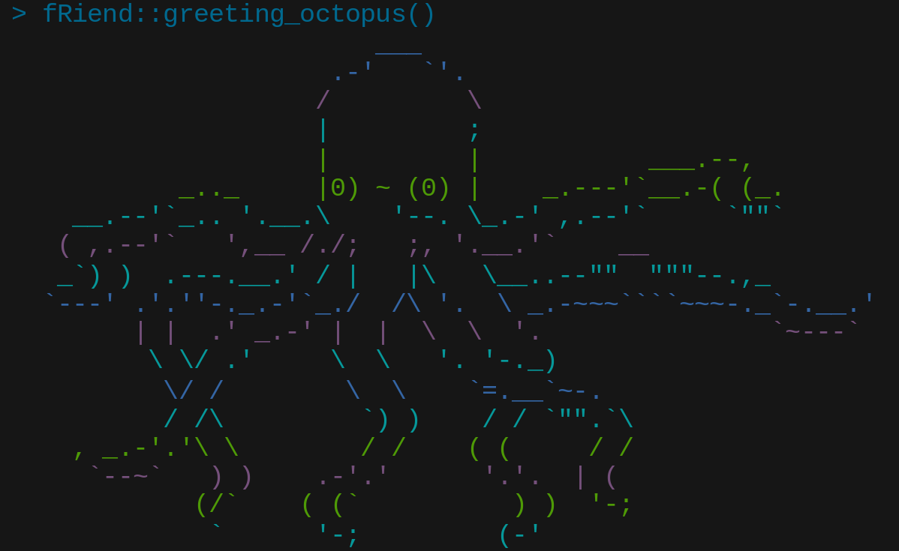
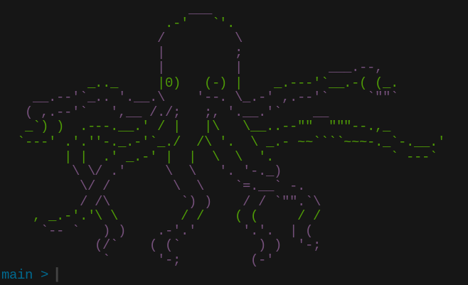
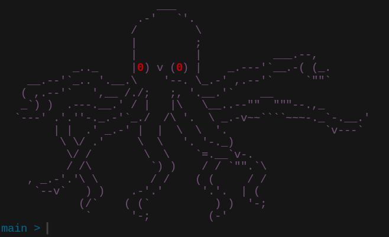
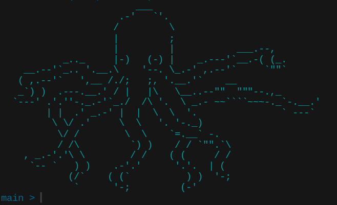
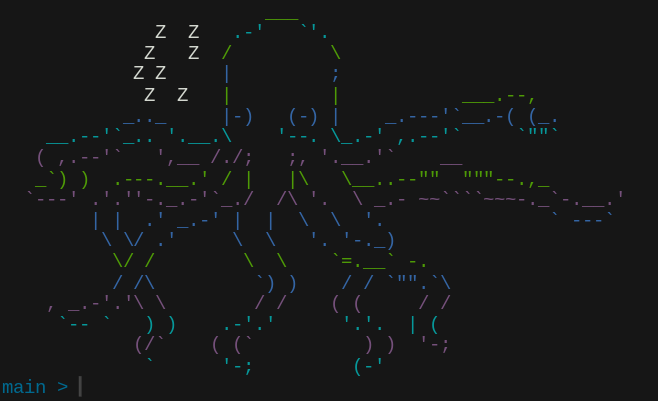
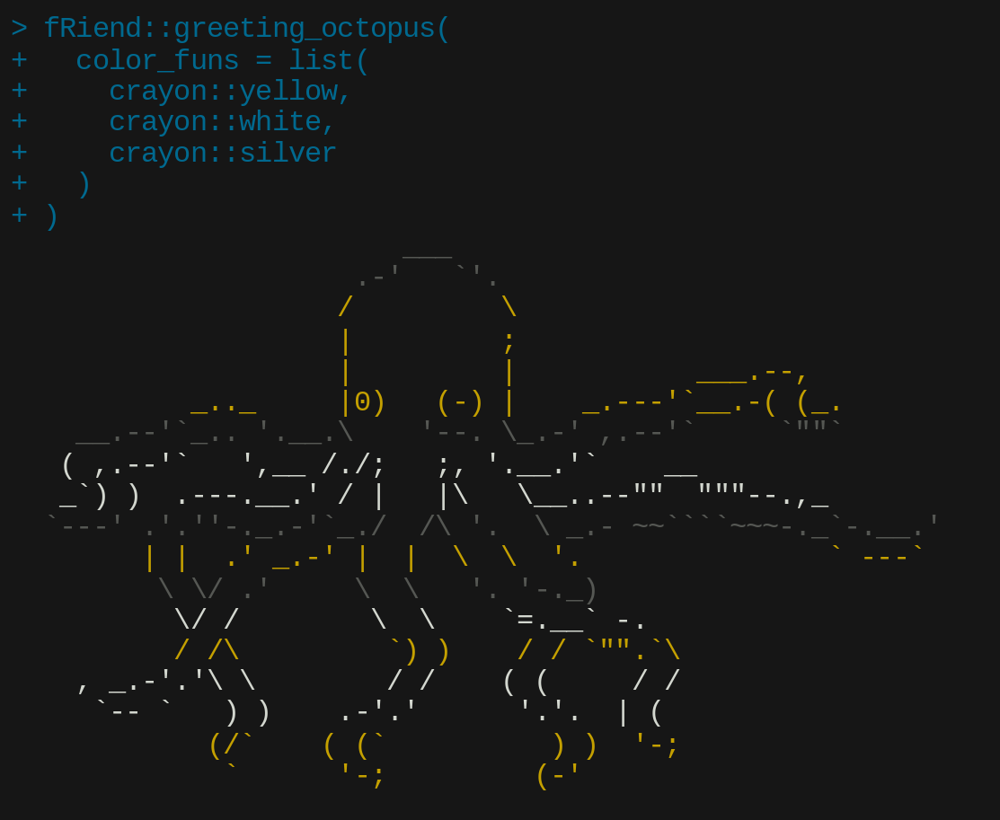

<!-- README.md is generated from README.Rmd. Please edit that file -->

# fRiend

<!-- badges: start -->
<!-- badges: end -->

**fRiend** exports one function: `greeting_octopus()`. This generates an
ASCII art octopus with randomized facial expressions and coloring,
`cat()`-ing it to the console:

<p align="center">

</p>

## Set up an octopus greeting

The main use-case of `greeting_octopus()` is including it in your
[`.Rprofile`](https://rstats.wtf/r-startup.html#rprofile) so that it is
executed each time you start up an R session. I recommend wrapping it in
`if (interactive()) { ... }`, like this:

``` r
if (interactive()) {
  
  fRiend::greeting_octopus()
  
}
```

Generally, your `.Rprofile` should be located in your [home
directory](https://en.wikipedia.org/wiki/Home_directory). If you have
[**devtools**](https://devtools.r-lib.org/) installed, you can edit your
`.Rprofile` by executing `devtools::edit_r_profile()`.

<!-- For information on how to customize your `.Rprofile`,
I recommend checking out [my blog post](link), where I go through what I have in mine. -->

## Installation

You can install the **fRiend** package from
[GitHub](https://github.com/) with:

``` r
# install.packages("remotes")
remotes::install_github("jamesotto852/fRiend")
```

## A few details

Here are a few examples of the different kinds of octopodes you can get
from `greeting_octopus()`:

<p align="center">
<table align="center" style="border-spacing: 0; border-collapse: collapse;">
<tr>
<td style="padding: 0px;">

</td>
<td style="padding: 0px;">

</td>
</tr>
<tr>
<td style="padding: 0px;">

</td>
<td style="padding: 0px;">

</td>
</tr>
</table>
</p>

------------------------------------------------------------------------

Finally, note that `greeting_octopus()` is customizible. If you’re not
feeling the angry eyes, you can disable them by setting
`include_angry = FALSE`. Also, if you’d rather draw from a different
color pallet you can provide an alternative list of functions from
[**crayon**](https://github.com/r-lib/crayon) to `color_funs`:

<p align="center">

</p>
